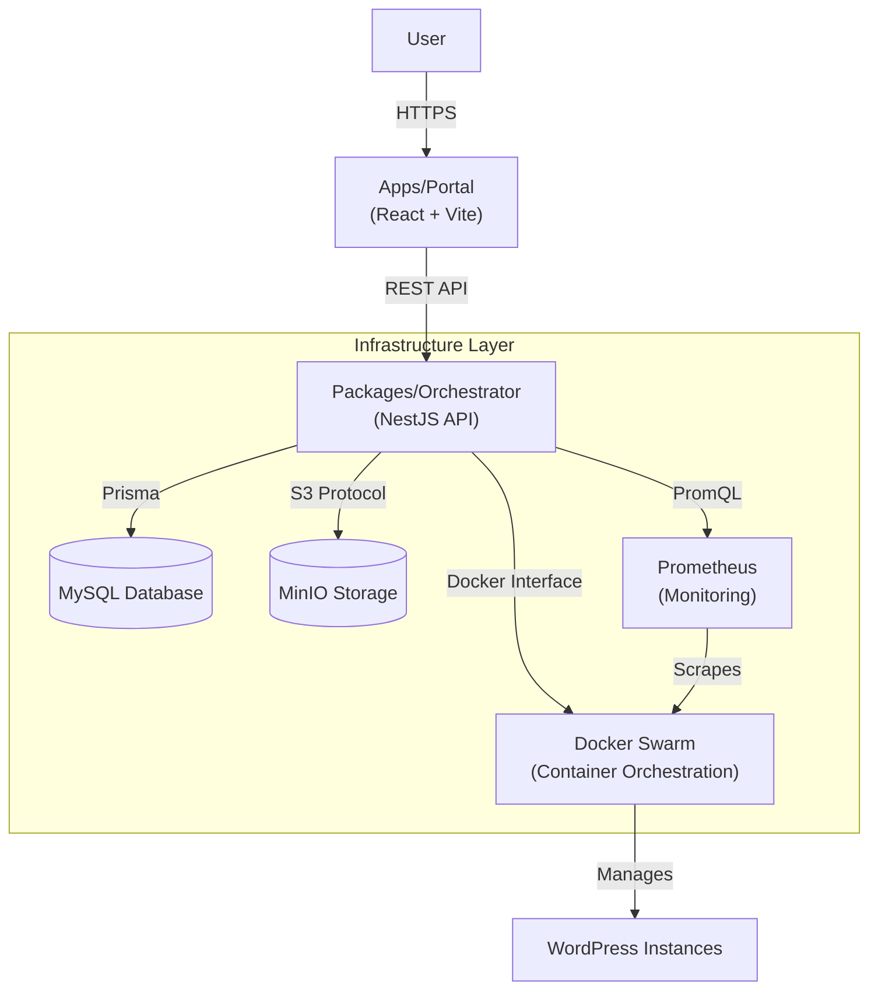
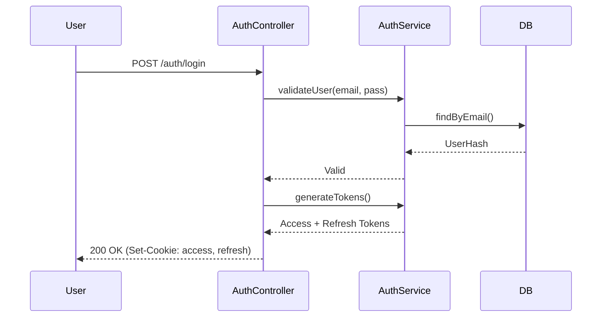
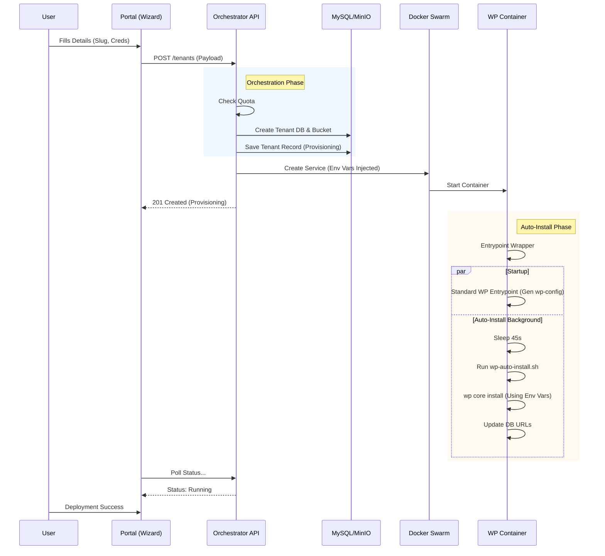
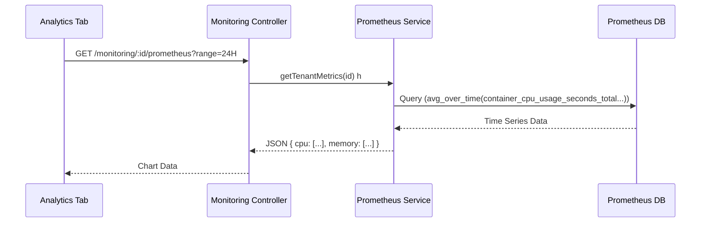
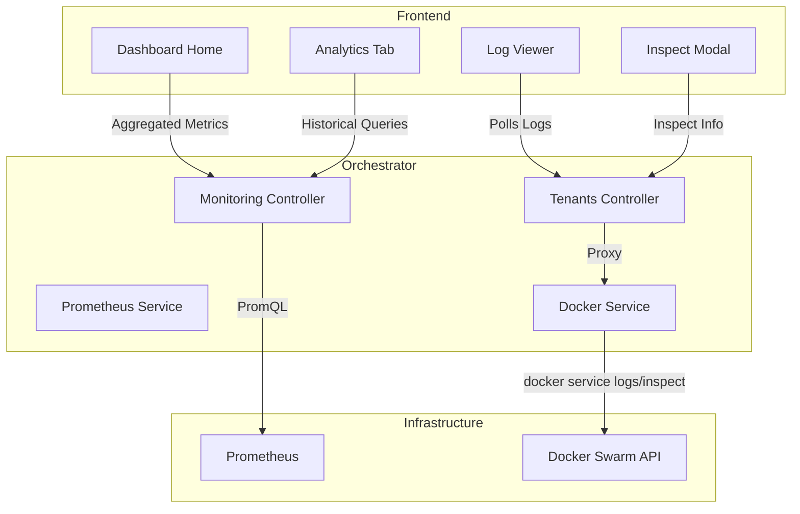
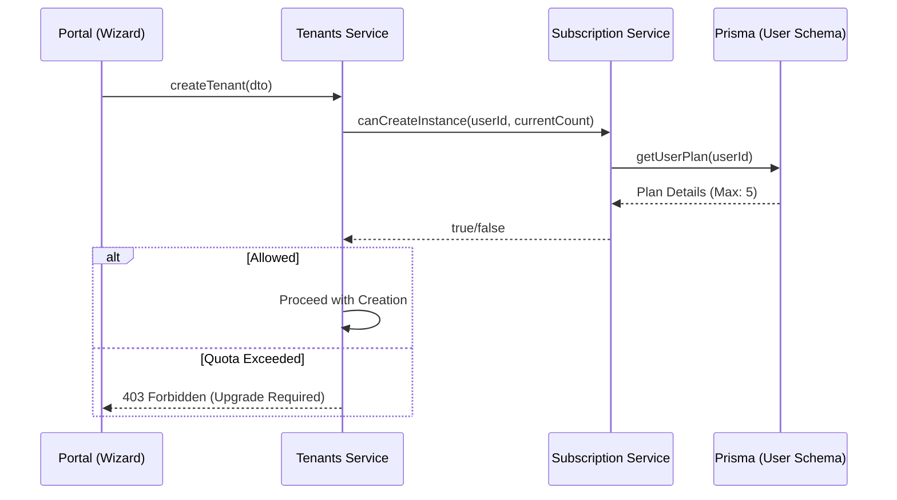
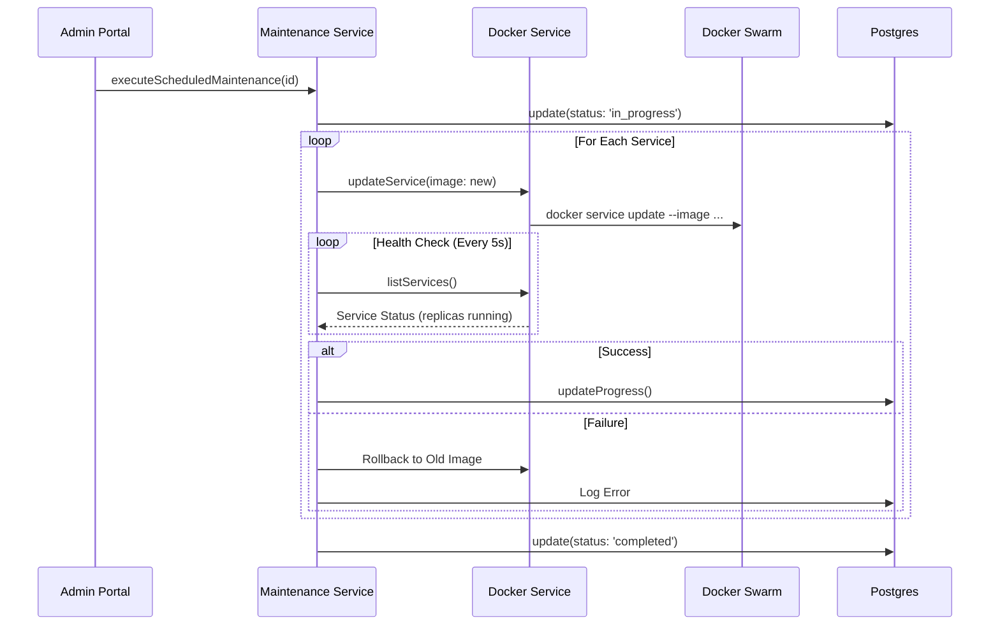

# System Architecture & Analysis

This document provides a deep analysis of the WordPress PaaS system, covering the `Portal` (Frontend) and `Orchestrator` (Backend) applications, along with their infrastructure and key features.

## 1. High-Level Architecture

The system follows a microservices-like architecture where a frontend portal communicates with a central orchestrator, which in turn manages the underlying infrastructure (Docker Swarm, Database, Storage).

### Component Overview

- **Apps/Portal**: A React-based Single Page Application (SPA) serving as the user interface for managing WordPress instances.
- **Packages/Orchestrator**: The core logic layer built with NestJS. It handles authentication, billing/quota management, and orchestrates the deployment of WordPress containers on Docker Swarm.
- **Infrastructure**:
  - **Docker Swarm**: Handles container scheduling, networking, and resource management.
  - **MySQL**: Stores user data, tenant metadata, and individual WordPress databases.
  - **MinIO**: Object storage for WordPress uploads and static assets.
  - **Prometheus**: Collects metrics from the Docker Swarm and containers.

---

## 2. Directory Structure & Technology Stack

### Apps/Portal (`apps/portal`)

- **Type**: Frontend SPA
- **Stack**: React 19, Vite, TypeScript, TailwindCSS (implied), Lucide React, Recharts.
- **Key Directories**:
  - `components/`: UI components (atomic design or functional grouping).
  - `context/`: Global state management (Auth, Dashboard).
  - `services/`: API communication layer (contains `mockApi.ts` for prototyping).
  - `src/`: Main application entry points and utils.

### Packages/Orchestrator (`packages/orchestrator`)

- **Type**: Backend API
- **Stack**: NestJS, Prisma, Passport (JWT), Dockerode.
- **Key Directories**:
  - `src/auth/`: Authentication logic (Guards, Strategies).
  - `src/tenants/`: Core instance management logic.
  - `src/docker/`: Wrapper service for Docker Swarm interactions.
  - `src/monitoring/`: Prometheus integration and logs.
  - `src/cluster/`: Cluster health and node management.
  - `prisma/`: Database schema and migrations.

---

## 3. Feature Analysis

### 3.1 Authentication

**Location**: `packages/orchestrator/src/auth`
**Mechanism**: JWT (JSON Web Tokens) with HTTP-only cookies.

The authentication system is secure and robust, using a dual-token strategy (Access + Refresh tokens).

**Architecture:**

1.  **Registration/Login**: User submits credentials. `AuthService` validates them against the `User` table (via `UserRepository`).
2.  **Token Generation**: Upon success, `JwtService` generates:
    - `access_token` (15 min expiry)
    - `refresh_token` (7 days expiry)
3.  **Cookie Storage**: Tokens are set as `HttpOnly`, `Secure` cookies to prevent XSS attacks.
4.  **Protection**: `JwtAuthGuard` and `JwtStrategy` intercept requests to protected routes, validating the `access_token`.

### 3.2 Instance Management (Tenants)

**Location**: `packages/orchestrator/src/tenants`
**Service**: `TenantsService`

This is the core feature. Creating an instance involves a complex orchestration of multiple services, ensuring that a user request translates into a fully functional, auto-installed WordPress site.

#### End-to-End Creation Flow

The process traverses the Frontend, Orchestrator API, Database, Storage, and Docker Swarm layers.

1.  **User Input (Frontend)**:

    - **Component**: `CreateInstanceWizard.tsx`
    - **Data Collected**: Instance Name, URL Slug, Region, Environment Variables, Admin Credentials.
    - **Action**: Sends `POST /tenants` payload to Orchestrator.

2.  **API Validation & Orchestration (Backend)**:

    - **Controller**: `TenantsController` validates the DTO.
    - **Service**: `TenantsService` orchestrates the setup:
      - **Quota Check**: Verifies subscription limits.
      - **Resource Prep**: Creates MySQL Database (`TenantDatabaseService`) and MinIO Bucket (`StorageService`).
      - **Record Creation**: Stores tenant metadata in `Prisma` (status: `provisioning`).

3.  **Docker Deployment**:

    - **Service**: `WordPressService`
    - **Action**: Configures a Docker Swarm Service (`ServiceSpec`).
    - **Critical Configuration**: Injects Environment Variables for the container to use during startup:
      - `WORDPRESS_ADMIN_USER`, `_PASSWORD`, `_EMAIL` (For auto-install)
      - `WORDPRESS_DB_HOST`, `_USER`, `_PASSWORD` (For connection)
      - `WP_PAAS_PATH_PREFIX` (For sub-directory routing support)
    - **Networking**: Attaches to overlay network and sets Traefik labels for routing.

4.  **Container Startup & Auto-Installation**:
    - **Image**: `packages/orchestrator/docker/wordpress/Dockerfile`
    - **Entrypoint Wrapper** (`docker-entrypoint-wrapper.sh`):
      1.  Starts the standard WordPress entrypoint (which creates `wp-config.php`).
      2.  Simultaneously starts a background process that waits 45s.
    - **Auto-Install Script** (`wp-auto-install.sh`):
      1.  Waits for `wp-config.php` creation and DB connection.
      2.  Checks `wp core is-installed`.
      3.  **Executes**: `wp core install --url=... --admin_user=...` using the injected env vars.
      4.  **Fixes URLs**: Updates `home` and `siteurl` to handle reverse proxy routing.

#### Sequence Diagram

#### Action Instances

- **Start/Stop**: Scales the Docker service replicas to 0 (stop) or N (start).
- **Restart**: Force updates the service to trigger a container replacement.
- **Rebuild**: Forces a pull of the latest Docker image (`docker.updateService`) and redeploys containers.
- **Vertical Scaling**: Updates resource limits (CPU/RAM) via `docker.updateServiceResources`.
- **Horizontal Scaling**: Updates replica count via `docker.scaleService`.

### 3.3 Monitoring & Observability

**Location**: `packages/orchestrator/src/monitoring`
**Service**: `PrometheusService` & `DockerService`

The system provides comprehensive observability through multiple layers: Aggregated Dashboard, Instance Analytics, Real-time Status, Live Logs, and Deep Container Inspection.

#### 1. Cluster & Aggregated Dashboard (`DashboardHome.tsx`)

**Goal**: Provide a high-level view of all user instances and system health.

- **Data Source**:
  - **Metrics**: Aggregates data from `GET /monitoring/:id/metrics` for _all_ running instances.
  - **Health**: `ClusterService` provides node status and total resource availability.
- **Flow**: Frontend polls `fetchLiveMetrics` every 30s -> Calls API for each running instance -> Sums CPU, RAM, and Network I/O.

#### 2. Instance Analytics (`AnalyticsTab.tsx` & `OverviewTab.tsx`)

**Goal**: Detailed historical performance data and real-time health gauges.

- **Primary Source (Prometheus)**:
  - **Endpoint**: `GET /monitoring/:id/prometheus` (Live) & `/history` (Historical).
  - **Metrics**:
    - **CPU**: `%` usage vs limit.
    - **Memory**: `%` usage vs limit (converted to GB).
    - **Network**: Inbound/Outbound bytes (converted to KB/s).
    - **Storage**: Volume usage (MVMe SSD simulation/actual).
- **Fallback (Docker Stats)**:
  - If Prometheus is unreachable, `OverviewTab.tsx` falls back to `dashboardService.getMetrics` which uses `docker.getServiceStats` (simulating `docker stats` command).

**Analytics Data Flow:**

#### 3. Live Logs (`LogViewerModal.tsx`)

**Goal**: Real-time streaming of container logs for debugging.

- **Implementation**: Polling mechanism (WebSockets not yet implemented).
- **Interval**: Polls every 3 seconds.
- **Endpoint**: `GET /tenants/:id/logs?tail=100`.
- **Backend Logic**:
  - `TenantsController` -> `TenantsService` -> `DockerService`.
  - Calls `service.logs()` from `dockerode` (Docker API).
  - Demuxes `stdout` and `stderr` streams into a unified text log.

#### 4. Deep Inspection (`ContainerInspectModal.tsx`)

**Goal**: Low-level Docker configuration visibility for advanced debugging.

- **Data Source**: Direct `docker inspect` equivalent.
- **Endpoint**: `GET /tenants/:id/inspect`.
- **Key Info Exposed**:
  - **Environment Variables**: `WORDPRESS_DB_HOST`, `WORDPRESS_ADMIN_USER`, etc. (Masked where appropriate).
  - **Mounts**: Verifies if `wp_content` volume is attached correctly.
  - **Networks**: Confirms attachment to `wp_paas_network`.
  - **Tasks**: Shows state of individual replicas (e.g., `Running` vs `Failed`).

**Monitoring Architecture Diagram:**

### 3.5 Subscription & Billing

**Location**: `packages/orchestrator/src/tenants`  
**Service**: `SubscriptionService`, `SubscriptionController`  
**Frontend**: `BillingTab.tsx`

The subscription system is the gatekeeper for resource allocation, enforcing limits on instances, replicas, and storage based on the user's selected plan.

#### 1. Plan Structure

Plans are defined in `PRICING_PLANS` within `subscription.service.ts`. Each plan defines:

- **Max Instances**: Hard limit on active WordPress sites.
- **Replicas**: Number of Docker replicas per instance (Horizontal Scaling).
- **Resources**: Storage and Bandwidth allocations.

| Plan Tier             | Max Instances | Replicas | Features          |
| :-------------------- | :------------ | :------- | :---------------- |
| **Free**              | 1             | 1        | Basic             |
| **Hobby**             | 2             | 1        | Custom Domain     |
| **Starter**           | 5             | 2        | Backups           |
| **Starter Plus**      | 8             | 2        | More Bandwidth    |
| **Professional**      | 15            | 3        | Priority Support  |
| **Professional Plus** | 25            | 3        | More Storage      |
| **Business**          | 50            | 4        | Priority Support+ |
| **Business Plus**     | 100           | 4        | High Performance  |
| **Agency**            | 200           | 5        | Reseller Ready    |
| **Enterprise**        | Unlimited     | 5        | All Features      |

#### 2. Quota Enforcement Flow

Before _any_ resource-intensive action (Create Instance, Scale), the `TenantsService` consults the `SubscriptionService`.

#### 3. Upgrade & Billing Flow

- **Upgrades**: Handled by `SubscriptionController.upgradePlan`. Automatically cancels the previous subscription and creates a new one with the start date as 'now'.
- **Invoices**: Managed via `dashboardService` logic (mocked or integrated with Stripe/Payment Provider).
- **Frontend**: `BillingTab` displays current usage (`quotaUsed` vs `quotaAllowed`) and triggers the `UpgradeModal`.

### 3.6 Maintenance & Orchestration

**Location**: `packages/orchestrator/src/admin`  
**Service**: `MaintenanceService`, `MaintenanceController`  
**Frontend**: `MaintenancePage.tsx`, `MaintenancePopup.tsx`

The maintenance system allows admins to schedule system-wide updates, manage announcements, and perform rolling updates of WordPress images with zero downtime.

#### 1. System Announcements & Popups

- **Announcements**: Admins can broadcast messages (`info`, `warning`, `maintenance`) with start/end times.
- **Public API**: `GET /announcements` and `GET /maintenance/status` allow unauthenticated clients (e.g., login page) to check system status.
- **Maintenance Mode**:
  - When a maintenance window is active, `MaintenancePopup.tsx` polls the status every 10s.
  - If active, it overlays a full-screen blocker preventing user interaction until maintenance is complete.

#### 2. Rolling Updates (Zero Downtime)

Updates to the Docker image (e.g., `wp-paas-wordpress:latest`) are performed sequentially to ensure service availability.

**Update Flow:**

1.  **Selection**: Admin selects target image and optional "Force Pull".
2.  **Scheduling**: Can be immediate or scheduled for a future `Date`.
3.  **Execution (`performRollingUpdateWithHealthCheck`)**:
    - Loops through all `wp_*` services.
    - Updates one service at a time.
    - **Health Check**: Waits up to 120s for the new replica to be `Running`.
    - **Rollback**: If the new container fails (health check timeout), it automatically reverts to the previous image.

### 3.7 Infrastructure & Clustering

**Location**: `packages/orchestrator/src/docker` & `cluster`

The system relies on **Docker Swarm Mode**.

- **Service Abstraction**: Instances are treated as "Services", not just containers. This allows for:
  - **Self-Healing**: Swarm automatically restarts failed tasks.
  - **Load Balancing**: Swarm's ingress mesh routes traffic to available replicas.
  - **Updates**: Rolling updates for zero-downtime deployment (rebuilds).
- **Cluster Health**: `ClusterService` aggregates node status (Active/Drain), resource availability (Total Cores/RAM), and global service counts.

---

## 4. API & Data Flow Summary

| Feature              | Endpoint                      | Controller             | Service             | Underlying Tech |
| :------------------- | :---------------------------- | :--------------------- | :------------------ | :-------------- |
| **Auth**             | `/auth/*`                     | `AuthController`       | `AuthService`       | JWT, Cookies    |
| **Create Instance**  | `POST /tenants`               | `TenantsController`    | `TenantsService`    | Prisma, Docker  |
| **Instance Details** | `GET /tenants/:id`            | `TenantsController`    | `TenantsService`    | Prisma, Docker  |
| **Start/Stop**       | `POST /tenants/:id/start`     | `TenantsController`    | `TenantsService`    | Docker Scale    |
| **Metrics**          | `GET /monitoring/:id/metrics` | `MonitoringController` | `PrometheusService` | PromQL          |
| **Logs**             | `GET /monitoring/:id/logs`    | `MonitoringController` | `MonitoringService` | Docker API      |

## 5. Specific Feature Implementation Details

### Profile & Maintenance

- **Profile**: Managed via `AuthController` (`/auth/profile`, `/auth/settings`). Updates `User` table.
- **Maintenance**:
  - **Cache Purge**: `TenantsService.purgeCache` (Mocked in current code, likely needs WP-CLI integration).
  - **PHP Restart**: `TenantsService.restartPhp` triggers a service update to restart containers.
  - **Rebuild**: Forces a pull of the latest Docker image and redeploys.

### Authorization

- **Role-Based (RBAC)**: Users have roles (`user`, `admin`).
- **Object-Level**: `TenantsController` checks if `tenant.userId === req.user.id`. Admins bypass this check.
- **Guards**: `JwtAuthGuard` ensures valid session.

---

## 6. Recommendations & Observations

- **Frontend API**: The Portal currently contains a `mockApi.ts`. Ensure the `services` layer is configured to hit the real Orchestrator endpoints in production usage.
- **Cache Purging**: The current implementation of `purgeCache` in `TenantsService` logs but doesn't execute a command. Integration with `WP-CLI` inside the container (via `docker exec`) is recommended.
- **Networking**: The system assumes a Traefik or similar reverse proxy setup for `ingress` routing based on the `endpoints` generated (e.g., `slug.domain.com`). This configuration would live in the Docker labels applied during service creation.
